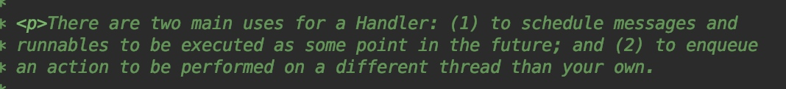
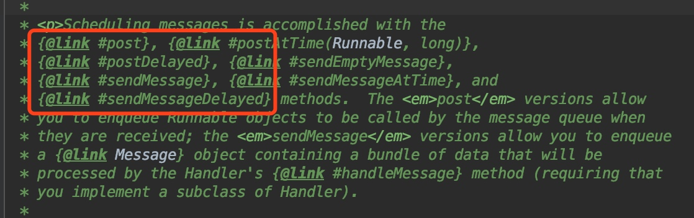

## 1. Handler到底有什么用 ？
作为一个程序员，想知道这个类到底是干嘛用的，很简单，查看源码，看官方的文档。如下图所示：

来自官方的解释，Hander的作用有如下两点：（忽略我蹩脚的中文搬运工）

1. 用于在特定时间内执行的Message和Runnable。
2. 用于在不同的线程中执行任务。

## 2. 知道了Handler有什么用，那么就要说一下Handler到底该怎么用。

我们再来先看官方文档的解释，Handler到底给我们提供了哪些传递消息的接口，如下截图标注的四个方法：



1：通过Runnable，post不延时执行，postDelayed则延时执行，延时的时间作为参数传递。

2：通过Message，sendMessage不延时执行，sendMessageDelayed则延时执行，延时时间作为参数传递。

### 2.1. 如何利用Handler执行定时任务。
1. 利用Runnable来实现

```
public class MainActivity extends AppCompatActivity {
    private Handler mHandler = new Handler();

    @Override
    protected void onCreate(Bundle savedInstanceState) {
        super.onCreate(savedInstanceState);
        setContentView(R.layout.activity_main);
        mHandler.postDelayed(new Runnable() {
            @Override
            public void run() {
                Log.d("Runnable", "welcome to lichaojian's blog");
            }
        }, 5000);
    }
```
2. 利用Message来实现，这里的Message与Runnable稍微有点不同，需要实现Handler.Callback回调来处理消息，如下源码：


```
public class MainActivity extends AppCompatActivity {
    private Handler mHandler = new Handler(new Handler.Callback() {
        @Override
        public boolean handleMessage(Message msg) {
            switch (msg.what) {
                case 1:
                    Log.d("Message", "welcome to lichaojian's blog");
                    break;
            }
            return false;
        }
    });

    @Override
    protected void onCreate(Bundle savedInstanceState) {
        super.onCreate(savedInstanceState);
        setContentView(R.layout.activity_main);
        Message message = new Message();
        message.what = 1;
        mHandler.sendMessageDelayed(message, 5000);
    }
}
```

### 2.2 怎么利用Handler在不同的线程中进行消息的传递呢？

1. 利用Runnable来实现


```
public class MainActivity extends AppCompatActivity {
    private Handler mHandler = new Handler();

    private Runnable mMainThreadRunnable = new Runnable() {
        @Override
        public void run() {
            Log.d("lichaojian", "ThreaName = " + Thread.currentThread().getName());
        }
    };

    @Override
    protected void onCreate(Bundle savedInstanceState) {
        super.onCreate(savedInstanceState);
        setContentView(R.layout.activity_main);

        findViewById(R.id.testHandler).setOnClickListener(new View.OnClickListener() {
            @Override
            public void onClick(View v) {
                new Thread(new Runnable() {
                    @Override
                    public void run() {
                        Log.d("lichaojian", "ThreadName = " + Thread.currentThread().getName());
                        mHandler.postDelayed(mMainThreadRunnable, 5000);
                    }
                }).start();
            }
        });
    }
}
```

2. 利用Message来实现


```
public class MainActivity extends AppCompatActivity {
    private Handler mHandler = new Handler(new Handler.Callback() {
        @Override
        public boolean handleMessage(Message msg) {
            switch (msg.what) {
                case 1:
                    Log.d("lichaojian", "ThreadName = " + Thread.currentThread().getName());
                    break;
            }
            return false;
        }
    });

    @Override
    protected void onCreate(Bundle savedInstanceState) {
        super.onCreate(savedInstanceState);
        setContentView(R.layout.activity_main);

        findViewById(R.id.testHandler).setOnClickListener(new View.OnClickListener() {
            @Override
            public void onClick(View v) {
                new Thread(new Runnable() {
                    @Override
                    public void run() {
                        Log.d("lichaojian", "ThreadName = " + Thread.currentThread().getName());
                        Message message = new Message();
                        message.what = 1;
                        mHandler.sendMessageDelayed(message, 5000);
                    }
                }).start();
            }
        });
    }
}
```

## 3.未完待续... (Android的消息传递机制-Handler（原理篇）)


